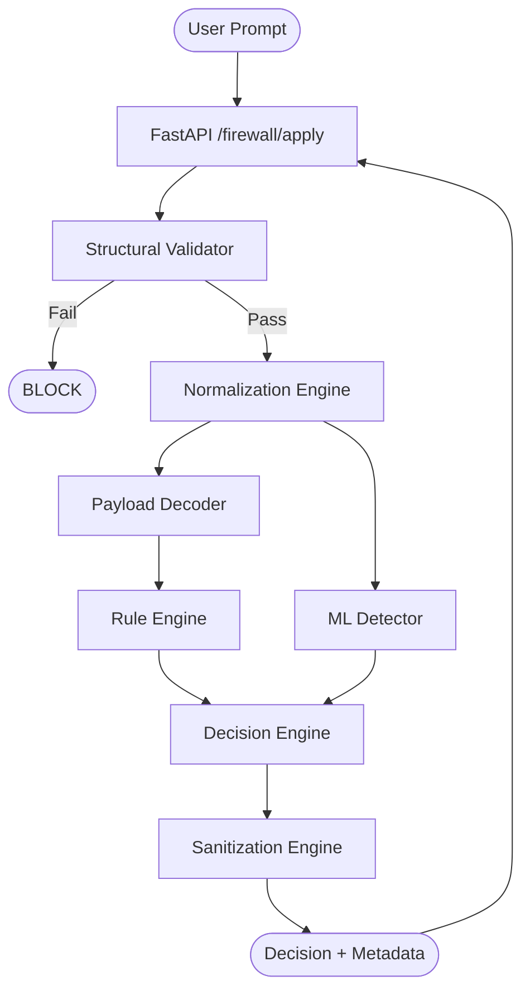

# SecureLLM Input Firewall Architecture

## Data Flow

## Subcomponents

### 1. Normalization Engine
Canonicalizes Unicode, strips hidden characters, and flattens whitespace.

### 2. Payload Decoder
Recursively decodes Base64, ROT13, and URL encoding to reveal hidden payloads.

### 3. Rule Engine (WAF Core)
Executes regex-based security signatures against normalized and decoded content.

### 4. ML Detector
Enterprise-grade intent analysis using a fine-tuned transformer model (`paraphrase-multilingual-MiniLM-L12-v2`). It classifies prompts into 5 categories: `BENIGN`, `INJECTION`, `POISONING`, `SMUGGLING`, and `OBFUSCATED`.

### 5. Decision Engine
Aggregates scores using **Intelligent Hybrid Logic**:
- **Whitelist Override**: Immediate **ALLOW** if the prompt matches the high-priority benign whitelist (e.g., "Tell me a joke").
- **Scoring**: Uses `max(rule_risk, effective_ml_score)`.
    - **Confidence Threshold**: `ml_score` is only considered if confidence is **≥ 60%**.
    - **Benign Bonus**: High-confidence **BENIGN** predictions (**≥ 90%**) can reduce combined risk by **-0.2**.
- **Consensus Bonus**: Adds a **+0.2** risk boost if both engines agree on a threat, but reduces to **+0.05** if either engine shows low individual risk (< 0.3).
- **Thresholds**: 
    - **BLOCK**: Combined Risk > 0.65.
    - **SANITIZE**: Combined Risk > 0.35.

### 6. Sanitization Engine
Neutralizes detected threats by stripping or masking malicious patterns without blocking the entire request.
